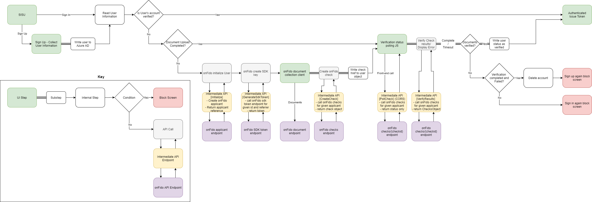

# Introduction

Onfido is a Document ID and facial biometrics verification SaaS that
allows companies to meet “Know Your Customer” and Identity requirements
in real time. Onfido uses sophisticated AI-based identity verification to 
prove a user’s real identity. First OnfIdo verifies a photo ID, then match 
it against their facial biometrics. This ties a user’s digital identity to 
their real-world person. Their seamless integration provides a safe 
onboarding experience while reducing fraud.

In this sample, we will connecting to Onfido's service in the sign-up or 
login flows to perform identity verification and enrich your user data 
with Onfido’s results to make informed decisions about which products 
or services the user can access.

# Solution Components

This verification solution comprises the following components:

  - **Azure AD B2C Tenant**: The Identity Provider (IdP), performs user
    verification based on custom policies defined in the tenant. Also
    hosts the Onfido client app which collects the user documents and
    transmits it to the Onfido API service

  - **Onfido Client**: A configurable javascript client document
    collection utility that can be deployed within other webpages.
    Collects the documents and performs preliminary checks (document
    size, quality etc…)

  - **RESTful Intermediate API**: Provides endpoints for the B2C Tenant
    to communicate with the Onfido API service, handling data processing
    and adhering to the security requirements of both.

  - **Onfido API Service**: The backend service provided by Onfido which
    saves and verifies the documents provided by the user.

## Workflow

Onfido process flow

## Setting Up the Solution

### Get an Onfido account
Get an account with Onfido and create an API key. Live keys are
billable, but you can use sandbox keys for trying out the solution. They
produce the same result structure as live keys, but the results are
always predetermined. Documents are not really processed or saved. Make
a note of the key. We will need it later.

To get a trial of Onfido’s, please visit: https://onfido.com/signup/
Onfido API Documentation: https://documentation.onfido.com
Onfido Developer Hub: https://developers.onfido.com

### Deploy the API

Deploy the provided API code to an Azure service. The code can be
published from Visual Studio, following
these [instructions](https://docs.microsoft.com/visualstudio/deployment/quickstart-deploy-to-azure?view=vs-2019).

Set-up CORS, add Allowed Origin `https://{your_tenant_name}.b2clogin.com`

Note the URL of the deployed service. We will need this later to
configure this later to configure Azure AD with the required settings.

#### Adding sensitive configuration settings

Application settings can be [configured in the App service in
Azure](https://docs.microsoft.com/en-us/azure/app-service/configure-common#configure-app-settings).
This allows for settings to be securely configured without checking them
into a repository. The Rest API needs the following settings provided:

| **Application Setting Name** | **Source**     | **Notes** |
| ---------------------------- | -------------- | --------- |
| OnfidoSettings:AuthToken     | Onfido Account |           |

### Deploy the UI

#### Configure your storage location

Set up a [blob storage container in your storage
account](https://docs.microsoft.com/en-us/azure/storage/blobs/storage-quickstart-blobs-portal#create-a-container).

Find the UI files from the **UI** folder and store them into your blob
container.

Allow CORS access to storage container you just created by following the instructions [here](https://docs.microsoft.com/en-us/azure/active-directory-b2c/custom-policy-ui-customization#3-configure-cors)
Settings:
- Allowed Origin: `https://{your_tenant_name}.b2clogin.com`
- Allowed Methods: `GET` and `PUT`

#### Update UI Files

In the UI Files, go to the folder **ocean\_blue**

Open each html file.

Find & replace **{your-ui-blob-container-url}** with the URL of where
your UI “ocean\_blue”, “dist” and “assets” folders are located

Find & replace **{your-intermediate-api-url}** with the Url of the
intermediate API app service.

#### Upload your files

Find the UI files from the **UI** folder and store them into your blob
container.

You can also use [Azure Storage Explorer](https://azure.microsoft.com/en-us/features/storage-explorer/) to manage your files and access permissions.

### Azure AD B2C Configuration

#### Replace the configuration values

In the provided custom policies, find the following placeholders and
replace with the corresponding values from your instance

Placeholder| Replace with | Example
-----------|--------------|--------------
{your_tenant_name}|Your tenant short name|“yourtenant” from yourtenant.onmicrosoft.com
{your_tenantId}|Tenant Id of your B2C tenant|01234567-89ab-cdef-0123-456789abcdef
{your_tenant_IdentityExperienceFramework_appid}|App Id of the IdentityExperienceFramework app configured in your B2C tenant|01234567-89ab-cdef-0123-456789abcdef
{your_tenant_ ProxyIdentityExperienceFramework _appid}|App Id of the ProxyIdentityExperienceFramework app configured in your B2C tenant|01234567-89ab-cdef-0123-456789abcdef
{your_tenant_extensions_appid}|App Id of your tenant’s storage application|01234567-89ab-cdef-0123-456789abcdef
{your_tenant_extensions_app_objectid}|Object Id of your tenant’s storage application|01234567-89ab-cdef-0123-456789abcdef
{your_app_insights_instrumentation_key}|Instrumentation key of your app insights instance*|01234567-89ab-cdef-0123-456789abcdef
{your_ui_file_base_url}|URL of where your UI “ocean_blue”, “dist” and “assets” folders are located|https://yourstorage.blob.core.windows.net/UI/
{your_app_service_url}|URL of your app service|https://yourapp.azurewebsites.net

\*App insights can be in a different tenant. This step is optional.
Remove the corresponding TechnicalProfiles and OrechestrationSteps if
not needed

#### Configure the B2C Tenant

For instructions on how to set up your b2c tenant and configure policies, visit [this
documentation](https://docs.microsoft.com/en-us/azure/active-directory-b2c/custom-policy-get-started?tabs=applications#custom-policy-starter-pack).

!As a best practice, we recommend that customers add consent notification in the attribute collection page. 
Notify users that information will be sent to third-party services for Identity Verification.